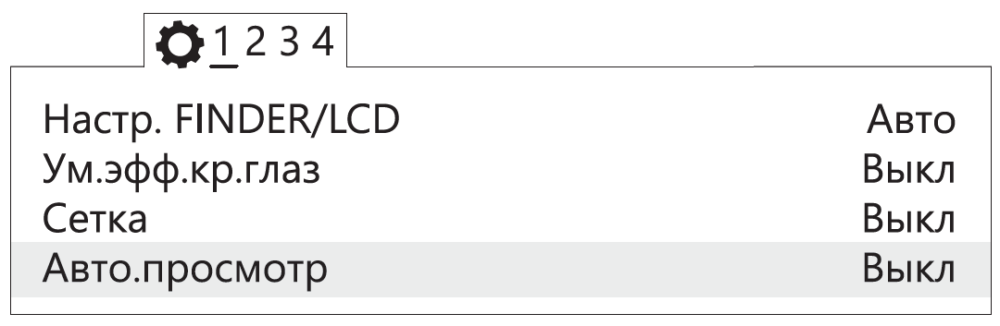

Настройка фотоаппарата
=========================

.. |icon_cam| image:: _static/_images/icon_cam.png
    :width: 25

.. |icon_key| image:: _static/_images/icon_key.png
    :width: 25

.. |icon_set| image:: _static/_images/icon_set.png
    :width: 25

.. |icon_bag| image:: _static/_images/icon_bag.png
    :width: 25

.. |icon_sd| image:: _static/_images/icon_sd.png
    :width: 25

Настройка фотоаппарата Sony DSC-RX1R II
------------------------------------------

Перед выполнением настроек ознакомьтесь с `инструкцией по эксплуатации фотоаппарата <https://www.sony.ru/electronics/support/res/manuals/4469/44695786M.pdf>`_, в которой описано назначение и использование органов управления.

* Диск режимов установите в положение **S** (Приоритет выдержки).
* Установите выдержку **1/1000**.
* Диск коррекции экспозиции установите в положение **0** (ноль).
* Кольцо переключения макро установите в положение **0,3m-∞**.
* Диск режима фокусировки установите в положение **MF**.

Для настройки параметров фотоаппарата нужно нажать кнопку **MENU**, затем, в соответствии с пунктами ниже, установить требуемые значения.

* В меню пользовательских установок |icon_set| (вкладка 1) отключите **Автоматический просмотр**.

   Отключение автоматического просмотра

* Установите для кнопки **MOVIE** - **Только режим видео** (вкладка 3).

.. figure:: _static/_images/menu11.png
   :width: 400
   :align: center

   Установка значения «Только режим видео»

* В меню настроек |icon_key| (вкладка 2) установите **Время начала энергосбережения** - **30 мин**.

   Установка времени начала энергосбережения

* В меню карты памяти |icon_sd| установите **Номер файла** - **Сброс**.

.. figure:: _static/_images/menu3.png
   :width: 400
   :align: center

   Сброс номера файла

Другие настройки фотоаппарата изменять не требуется.

**Форматирование карты памяти**

1) Последовательно выберите **MENU →** |icon_sd| **[Карта памяти]** **→ Форматировать**

.. attention::  Все данные на карте памяти будут удалены!

**Сброс настроек**

Для сброса всех настроек:

1) последовательно выберите **MENU →** |icon_key| **[Настройки] → Инициализировать  → Сброс настроек**

.. attention::  Не извлекайте батарейный блок во время сброса или преустановки значений настроек!

2) После сброса установите время и дату. Если пропустить это действие, настройки фотоаппарата сохраняться не будут.
3) Выключите фотоаппарат с помощью переключателя ON/OFF.
4) Не отключайте фотоаппарат от сети или АКБ в течение 3-х минут для сохранения настроек во внутреннюю память.

.. important:: Фотоаппарат может выводить сообщение **E:61:00**. Это означает, что он сфокусирован на максимальную дальность. На работоспособность не влияет.

Учет смещения центра фотографирования
--------------------------------------------------------

Так как антенна геодезического приемника расположена внутри БВС, фазовый центр смещен относительно центральной точки объектива камеры.
Величину смещения следует учитывать при точном построении ортофотопланов и 3D-моделей.

.. figure:: _static/_images/camera_position.png
   :align: center
   :width: 900

   Координаты фазового центра антенны GNSS-приемника относительно центральной точки объектива камеры